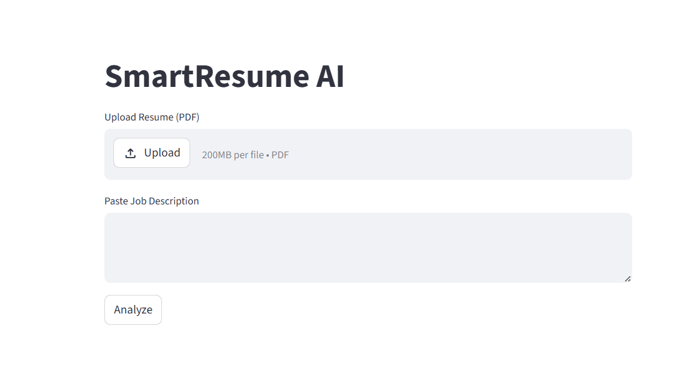
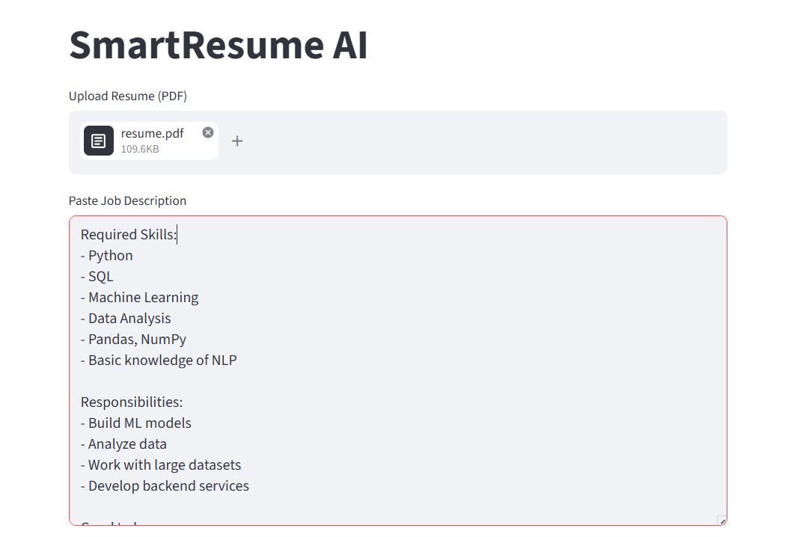
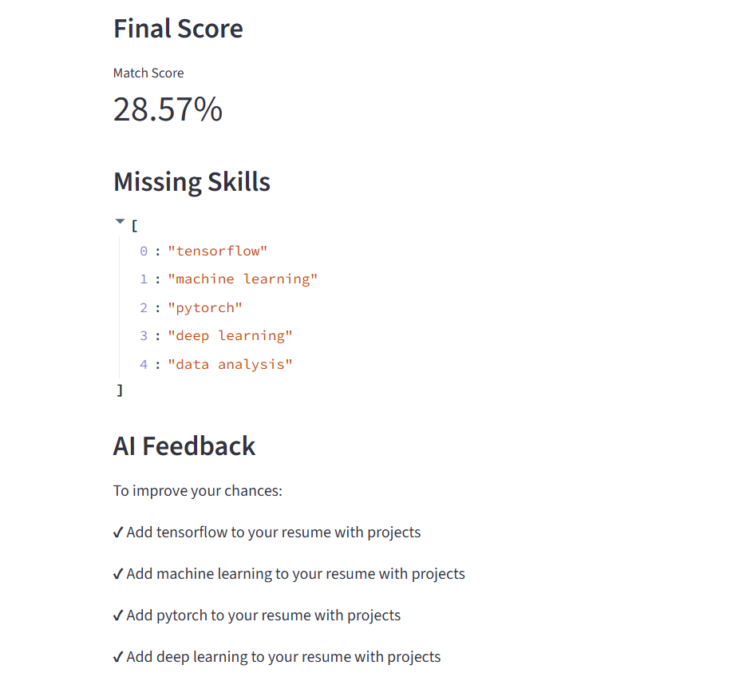
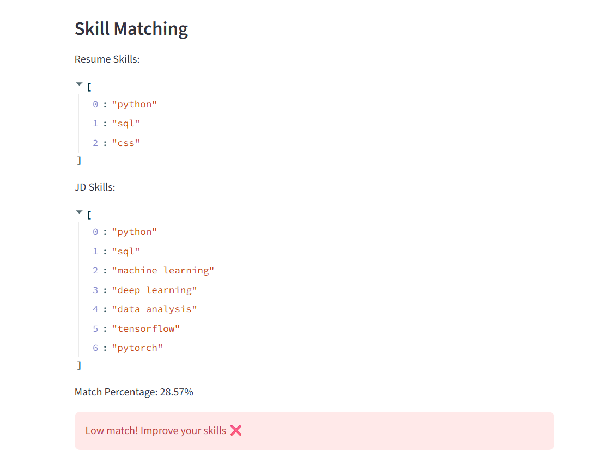

 SmartResume AI

 📌 Project Overview
SmartResume AI is an application that analyzes the content of a resume and checks it against a job description for calculating match score and offering tips for improvement.

 🚀 Features
- Text extraction from PDF resumes
- Skill detection from resume
- Comparison with the job description
- Calculation of match percentage
- Missing skills
- Tips from AI

 ▶️ Technology Stack
- Python
- Streamlit
- pdfplumber

 ▶️ How to Run
pip install -r requirements.txt  
streamlit run app.py  
 📷 Screenshots

 Home Screen

 Input Screen

 Score

 Skill Matching

 

 🎥 Demo Video
(Link to the demo video to be provided here)

 📦 Example Input Data
- Resume (PDF)
- Job description (Text)

 📊 Example Output Data
- Match percentage
- Missing skills
- Feedback
